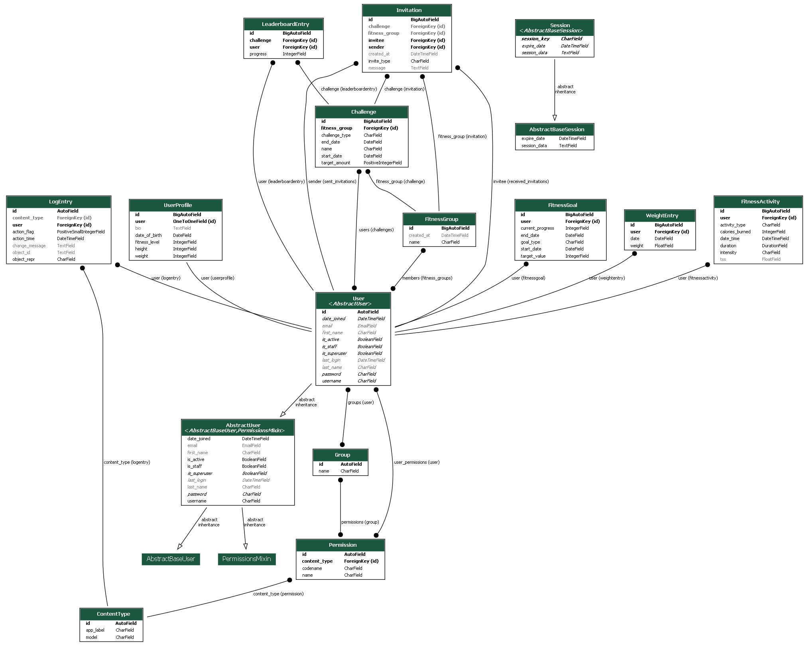

# Fitness Friends Challenge

Welcome to the **Fitness Friends Challenge**, our intuitive and dynamic web application designed to help users monitor and achieve their health and fitness goals, create challenges with a group of friends and have e healthy competition along the way. Built with Django (initially forked from https://github.com/iferco/django-health-tracker), this responsive application offers a seamless experience for tracking daily fitness activities, dietary habits (to be reitroduced later), and weight progress.

## Features

- **Activity Log**:  Log and track various physical activities with details such as duration, intensity, calories burned, and Training Stress Score (TSS).
- **Dietary Tracker**: Monitor daily food and water intake, including comprehensive nutritional information (this feature is currently commented out but can be enabled as needed).
- **Weight Tracker**: Record and visualize weight changes over time with dynamic charts.
- **Fitness Goals**: Set, monitor, and achieve fitness goals, whether it's weight loss, muscle gain, or maintaining a healthy lifestyle.
- **Challenges and Leaderboards**:  Create and participate in group challenges, view leaderboard rankings, and track progress towards challenge goals.
- **Responsive Design**: Access the tracker easily on any device, perfect for updates and checks on the go.
- **User Authentication**: Secure user registration and login, ensuring data privacy and security.

## Technologies

- **Backend**: Python and Django for robust and scalable application structure.
- **Frontend**: HTML, CSS, and JavaScript for a user-friendly interface.
- **Data Visualization**: Chart.js for rendering interactive and informative graphs.
- **Database**: SQLite for development, with easy scalability to PostgreSQL or other databases for production.

## TODO
- Prevent minus on Fitness level when registering a new user [v]
- Date type misaligned at register form [v]
- Hide request to join from group if user is already part of it [v]
- Send invitation (list correctly the challenges on each fitness group)
- Send invitation (only show appropriated fields depending on the invite type)
- Create manager role for fitness groups [v]
- Assign only manager to be able to change group visibility
- Create manager role for challenges
- Assign only manager to be able to edit challenges
- Fix TSS graph in the initial home
- Revisit css across app (yeah, it is not beautifull yet)
- Add Perceived Effort [v]
- Add Distance [v]

## Getting Started

1. **Clone the Repository**:

``` git clone git@github.com:aguirreSL/fitnessFriendsChallenge.git```

```or```

``` git clone https://github.com/aguirreSL/fitnessFriendsChallenge.git```

2. **Navigate to the project directory**:
```
cd fitnessFriendsChallenge
```

3.1 **Set Up a Virtual Environment Mac**:
```
python -m venv env
source env/bin/activate
```
3.2 **Set Up a Virtual Environment Windows**:
```
python -m venv env
env\Scripts\activate
```

4. **Install Dependencies**:
```
pip install -r requirements.txt
```

5. **Generate a Secret Key**:
Run the following command to generate a new secret key:
```
python -c 'from django.core.management.utils import get_random_secret_key; print(get_random_secret_key())'
```
6. **Create the `.env` File**:
This project uses environment variables to store sensitive information.
You need to create a `.env` file. In the root directory of the project, create a file named .env.

- **macOS/Linux**: Run the following command to create the `.env` file:

  ``` bash
  touch .env
  ```
  - **Windows**:  Use the following command in your terminal:
```
  echo. > .env
```

Copy the generated secret key and paste it into the SECRET_KEY field in the .env file like this:

```
SECRET_KEY=hfg93jgh$0f3o3m=f*al50!exnp^$f$qlr^0as9+md+v
```

A complete view of .env can be
```
SECRET_KEY=your_generated_secret_key
DEBUG=True  # Set to False in production (deployed)
DATABASE_URL=your_database_url  # Add your database URL if using a remote database
```

Important: Never share your .env file publicly, especially when deploying to production


7. **Initialize the Database**:
```
python manage.py makemigrations
python manage.py migrate
```

8. **Create a superuser (optional but recommended for admin access)**:
```
python manage.py createsuperuser
```

9. **Run the Server**:
```
python manage.py runserver
```

## UML Diagram
You can generate the class diagram with:
```
python manage.py graph_models -a -o Diagram.png
```
```
Command Breakdown:
python manage.py: Runs the Django management script.
graph_models: Generates a graphical representation of your models.
-a: Includes all apps in the project.
-o Diagram.png: Saves the output as Diagram.png.
```

Below is the current UML diagram for the project:



